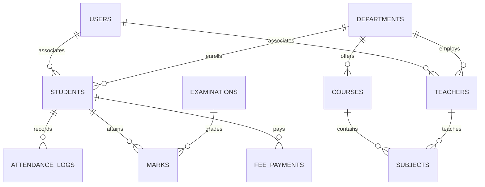

# Kalpanaaa Education Enterprise — Comprehensive Project Documentation

---

## 1. Executive Summary & Overview

**Kalpanaaa Education** is a full-stack, enterprise-grade **College & Campus Management Information System (ERP/CMS)**. It bridges institutional operations, academic administration, faculty management, and student services into a unified, secure portal ecosystem.

The system features:
- **Multi-Tenant Role-Based Access Control (RBAC)**: Distinct, isolated workflows for **Administrators**, **Teachers/Faculty**, and **Students**, alongside a public institutional portal.
- **Enterprise Java Backend**: Powered by **Java 17** and **Spring Boot 3**, with **Spring Security 6**, stateless **JWT authentication**, and **BCrypt** password hashing.
- **Resilient Dual-Mode Data Layer**: Native integration with **Spring Data JPA**, supporting **in-memory H2** for rapid development and **MySQL** for scalable production environments.
- **Modern React & TypeScript Frontend**: Engineered with **React 18**, **TypeScript**, **Vite**, modern **pure CSS**, **React Router**, and **TanStack React Query / Axios**.

---

## 2. Technology Stack

### Backend (`/backend`)
| Component | Technology | Version / Details |
| :--- | :--- | :--- |
| **Language** | Java | 17 (LTS) |
| **Framework** | Spring Boot | 3.2.5 |
| **Security** | Spring Security & JWT | Spring Security 6, JJWT 0.12.5, BCrypt |
| **Persistence / ORM** | Spring Data JPA / Hibernate | Entity relations, Repositories, Criteria API |
| **Databases** | H2 & MySQL | H2 In-Memory (dev/test), MySQL 8.0+ Driver (prod) |
| **Build Tool** | Apache Maven | Maven 3.9+ (`pom.xml`) |

### Frontend (`/frontend`)
| Component | Technology | Version / Details |
| :--- | :--- | :--- |
| **Core Framework** | React | 18.2.0 |
| **Language** | TypeScript | 5.2.2 |
| **Build & Bundler** | Vite | 5.1.6 |
| **Routing** | React Router DOM | 6.22.3 |
| **State & Data Fetching**| TanStack React Query & Axios | v5 QueryClient, Axios Interceptors |
| **Styling** | Modern CSS | CSS Custom Properties, Glassmorphism, Responsive Grid |
| **Iconography** | Lucide React | 0.359.0 |

---

## 3. High-Level System Architecture

```mermaid
graph TD
    subgraph Client Layer (React 18 + TypeScript + Vite)
        Pub[Public Visitor Portal]
        Adm[Admin Portal Console]
        Tch[Teacher & Faculty Portal]
        Std[Student Portal]
        Axios[Axios API Client + JWT Interceptors]
        ReactQuery[TanStack React Query Cache]
    end

    subgraph API Gateway & Security Layer (Spring Boot 3)
        ViteProxy[Vite Dev Proxy :3000]
        SpringSecurity[Spring Security 6 Filter Chain]
        JwtFilter[JwtAuthenticationFilter]
        Controllers[Spring REST Controllers :5000]
    end

    subgraph Service & Persistence Layer
        Services[Spring Services & Business Logic]
        JPA[Spring Data JPA Repositories]
    end

    subgraph Database Layer
        H2[(H2 In-Memory DB - Dev)]
        MySQL[(MySQL 8.0 Database - Prod)]
    end

    Pub --> Axios
    Adm --> Axios
    Tch --> Axios
    Std --> Axios
    Axios --> ReactQuery

    Axios -->|HTTP / REST Requests| ViteProxy
    ViteProxy -->|/api Reverse Proxy| SpringSecurity
    SpringSecurity --> JwtFilter
    JwtFilter --> Controllers
    Controllers --> Services
    Services --> JPA
    JPA -->|Default Profile: h2| H2
    JPA -->|Active Profile: mysql| MySQL
```

---

## 4. Database Schema & Entity Relationships

The relational model handles all institutional entities with referential integrity and performance indexing:



### Key Domain Entities

1. **`User`**: Core identity entity storing authentication credentials, hashed passwords, roles (`ROLE_ADMIN`, `ROLE_TEACHER`, `ROLE_STUDENT`), and identifier numbers.
2. **`Student`**: Comprehensive academic profile including `rollNo`, `email`, `department`, `course`, `semester`, `gpa`, and `attendancePercentage`.
3. **`Teacher`**: Faculty records, designations, department affiliations, qualifications, assigned subjects, and contact details.
4. **`Department`**: Academic departments (`CSE`, `ECE`, `ME`) with assigned Head of Department (HOD).
5. **`Course` & `Subject`**: Academic programs, credit structures, syllabus outlines, and semester allocations.
6. **`AttendanceLog`**: Timestamped student attendance records (by date, period, and subject) marked by faculty.
7. **`Examination` & `Mark`**: Evaluation lifecycle from exam scheduling to internal assessment and gradebook computation.
8. **`Assignment`**: Coursework prompts, due dates, subject allocations, and submission counters.
9. **`FeePayment`**: Tuition and exam fee transactions with auto-generated transaction IDs.
10. **`AdmissionApplication`**: Online applicant pipeline with tracking reference numbers.
11. **`HelpdeskTicket`**: Support desk tickets raised by students and staff.
12. **`LeaveRequest`**: Faculty and student leave application approval engine.

---

## 5. User Roles, Security & Authentication Flow

### Role-Based Access Matrix

| Feature / Domain | Public / Guest | Student | Teacher / Faculty | Administrator |
| :--- | :---: | :---: | :---: | :---: |
| **Institutional Information & Courses** | View | View | View | Full Control |
| **Online Admission Application** | Submit | N/A | N/A | Review & Approve |
| **Personal Attendance & Schedule** | ❌ | View | View/Check-in | Full Control |
| **Marking Student Attendance** | ❌ | ❌ | Class Level | Full Control |
| **Assignments & Homework** | ❌ | Submit Work | Create & Grade | Manage All |
| **Examination Marks & Gradebook** | ❌ | View Personal | Enter / Publish | Manage & Audit |
| **Fee Invoices & Payments** | ❌ | Pay & Receipt | ❌ | Reconcile & Report |
| **Faculty & Student Directory** | Limited | Directory | Directory | Full CRUD & Status |
| **Department & Course Setup** | ❌ | ❌ | ❌ | Full CRUD |

### Authentication Protocol
- **JWT Authentication**: Signed with HMAC-SHA256 containing user identity, claims, and role authorities.
- **Client Storage**: Managed securely in `localStorage` under `kalpanaaa_auth_token`.
- **Password Security**: BCrypt password hashing with high work-factor salting.
- **Route Protection**: Client-side `<ProtectedRoute allowedRoles={[...]} />` and Spring Security method security `@PreAuthorize("hasAuthority(...)")`.

---

## 6. Universal Enterprise Directory Structure

```
Kalpanaaa Education/
├── backend/                                  # Java 17 + Spring Boot 3 Maven Project
│   ├── pom.xml                               # Maven POM (Spring Boot, Security, JPA, JWT, H2, MySQL)
│   └── src/
│       ├── main/
│           ├── java/com/kalpanaa/education/
│           │   ├── KalpanaaEducationApplication.java # Application Main Entry Point
│           │   ├── config/                   # Security, JWT, CORS & Data Seeding
│           │   │   ├── SecurityConfig.java   # Spring Security 6 FilterChain & RBAC
│           │   │   ├── JwtTokenProvider.java # JWT Token Generation & Claims Validation
│           │   │   ├── JwtAuthenticationFilter.java # OncePerRequestFilter Token Extraction
│           │   │   └── DataInitializer.java  # Preloads demo admin, teachers, students & subjects
│           │   ├── controller/               # REST API Endpoints (@RestController)
│           │   │   ├── AuthController.java
│           │   │   ├── StudentController.java
│           │   │   ├── TeacherController.java
│           │   │   ├── AcademicController.java
│           │   │   ├── AttendanceController.java
│           │   │   └── OperationsControllers.java # Exams, Marks, Fees, Admissions, Helpdesk
│           │   ├── dto/                      # Data Transfer Objects & API Envelopes
│           │   │   └── AuthDto.java
│           │   ├── exception/                # Global Exception Handling & Error DTOs
│           │   │   ├── GlobalExceptionHandler.java
│           │   │   ├── ResourceNotFoundException.java
│           │   │   └── ErrorResponse.java
│           │   ├── model/                    # JPA Relational Entities (@Entity)
│           │   │   ├── Role.java
│           │   │   ├── User.java
│           │   │   ├── Student.java
│           │   │   ├── Teacher.java
│           │   │   ├── Department.java
│           │   │   ├── Course.java
│           │   │   ├── Subject.java
│           │   │   ├── AttendanceLog.java
│           │   │   ├── Examination.java
│           │   │   ├── Mark.java
│           │   │   ├── Assignment.java
│           │   │   ├── FeePayment.java
│           │   │   ├── AdmissionApplication.java
│           │   │   ├── HelpdeskTicket.java
│           │   │   └── LeaveRequest.java
│           │   ├── repository/               # Spring Data JPA Repositories
│           │   │   ├── UserRepository.java
│           │   │   ├── StudentRepository.java
│           │   │   ├── TeacherRepository.java
│           │   │   ├── DepartmentRepository.java
│           │   │   ├── CourseRepository.java
│           │   │   ├── SubjectRepository.java
│           │   │   ├── AttendanceLogRepository.java
│           │   │   └── AcademicRepositories.java
│           │   └── service/                  # Business Logic Layer (Interfaces & Impl)
│           │       ├── CustomUserDetailsService.java
│           │       ├── StudentService.java
│           │       ├── TeacherService.java
│           │       └── impl/
│           │           ├── StudentServiceImpl.java
│           │           └── TeacherServiceImpl.java
│           └── resources/
│               ├── application.yml           # Default In-Memory H2 Configuration
│               └── application-mysql.yml     # Production MySQL Profile Configuration
│       └── test/
│           └── java/com/kalpanaa/education/
│               └── KalpanaaEducationApplicationTests.java
│
├── frontend/                                 # React 18 + TypeScript + Vite Project
│   ├── package.json                          # Dependencies & NPM Scripts
│   ├── tsconfig.json                         # TypeScript Compiler Options
│   ├── tsconfig.node.json
│   ├── vite.config.ts                        # Bundler & Proxy Configuration
│   ├── index.html                            # HTML5 Single Page Application Template
│   └── src/
│       ├── main.tsx                          # React DOM Root Entry
│       ├── App.tsx                           # Global Providers & Router Mount
│       ├── components/
│       │   ├── common/                       # Reusable UI Primitives (Card, Badge, Spinner)
│       │   │   ├── Card.tsx
│       │   │   ├── Badge.tsx
│       │   │   └── LoadingSpinner.tsx
│       │   ├── layout/                       # Layout Components
│       │   │   ├── Navbar.tsx
│       │   │   └── Sidebar.tsx
│       │   └── ProtectedRoute.tsx            # Role-Based Route Guard
│       ├── context/
│       │   └── AuthContext.tsx               # Global Authentication State
│       ├── layouts/
│       │   └── MainLayout.tsx                # Master Layout with Navbar & Viewport
│       ├── pages/                            # Role & Domain Views
│       │   ├── public/
│       │   │   ├── HomePage.tsx
│       │   │   └── AdmissionsPage.tsx
│       │   ├── auth/
│       │   │   └── LoginPage.tsx
│       │   ├── admin/
│       │   │   └── AdminDashboard.tsx
│       │   ├── teacher/
│       │   │   └── TeacherDashboard.tsx
│       │   └── student/
│       │       └── StudentDashboard.tsx
│       ├── routes/
│       │   └── AppRoutes.tsx                 # Central Route Configuration Tree
│       ├── services/
│       │   └── api.ts                        # Axios HTTP Client with JWT Interceptors
│       ├── styles/
│       │   └── index.css                     # Modern CSS System & Design Tokens
│       └── types/
│           └── index.ts                      # Strict TypeScript Interfaces
└── DOCUMENTATION.md                          # Full Architecture & Setup Guide
```

---

## 7. REST API Reference

### Authentication
- `POST /api/auth/login`: Authenticate any user role with email and password.
- `POST /api/auth/student-signup`: Public registration for new students.
- `GET /api/auth/me`: Fetch current authenticated user profile.

### Institutional Entities
- `GET /api/students` | `POST /api/students` | `PUT /api/students/:id` | `DELETE /api/students/:id`
- `GET /api/teachers` | `POST /api/teachers` | `PUT /api/teachers/:id` | `DELETE /api/teachers/:id`
- `GET /api/departments` | `POST /api/departments`
- `GET /api/courses` | `POST /api/courses`
- `GET /api/subjects` | `POST /api/subjects`

### Academic Operations
- `GET /api/attendance` | `POST /api/attendance` | `POST /api/attendance/bulk`
- `GET /api/examinations` | `POST /api/examinations`
- `GET /api/marks` | `POST /api/marks`
- `GET /api/assignments` | `POST /api/assignments`
- `GET /api/fees` | `POST /api/fees/pay`
- `GET /api/admissions` | `POST /api/admissions/apply`
- `GET /api/helpdesk` | `POST /api/helpdesk`
- `GET /api/leave-requests` | `POST /api/leave-requests`
- `GET /api/health`: System health monitor and runtime details.

---

## 8. Local Setup & Execution Guide

### Prerequisites
- **Java**: JDK 17 or higher
- **Maven**: 3.9+ (or Maven Wrapper)
- **Node.js**: v18.0.0 or higher
- **npm**: v9.0.0 or higher

---

### Step 1: Running the Backend (Spring Boot 3)

Navigate to the `backend/` directory:
```bash
cd backend
```

#### Run with Default In-Memory H2 Database:
```bash
mvn spring-boot:run
```
- Backend starts at: `http://localhost:5000`
- H2 Console available at: `http://localhost:5000/h2-console` (JDBC URL: `jdbc:h2:mem:kalpanaaadb`)

#### Run with MySQL Database:
```bash
mvn spring-boot:run -Dspring-boot.run.profiles=mysql
```

---

### Step 2: Running the Frontend (React + TypeScript + Vite)

In a separate terminal, navigate to the `frontend/` directory:
```bash
cd frontend
npm install
npm run dev
```
- Frontend application starts at: `http://localhost:3000`
- API requests to `/api/*` are automatically proxied to the Spring Boot server at `http://localhost:5000`.

---

## 9. Default System Demo Credentials

| Role | Email / Identifier | Password | Access Scope |
| :--- | :--- | :--- | :--- |
| **Administrator** | `admin@kalpanaaa.edu` | `admin123` | Institutional Admin & Control Center |
| **Faculty / Teacher** | `teacher@kalpanaaa.edu` | `teacher123` | Faculty Portal, Attendance, Grading |
| **Student** | `student@kalpanaaa.edu` | `student123` | Student Dashboard, Attendance, Grades |

---

*Documentation maintained by Kalpanaaa Education Engineering Team.*
